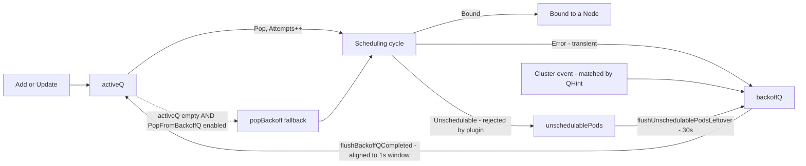

# The Packed Cluster Problem in kube-scheduler

> Definition only. This document does not propose a fix.
>
> Source: [kubernetes/kubernetes#138249](https://github.com/kubernetes/kubernetes/issues/138249), in particular the comment by `@sanposhiho` on Apr 9, 2026 at 3:35pm. The framing here paraphrases that discussion and grounds it in the current scheduler queue code.

## TL;DR

In an *always-packed cluster* (e.g., batch / TPU / gang workloads where there is essentially never enough free capacity to drain the unschedulable pool), every pending pod quickly hits `PodMaxBackoffSeconds`. At that point the backoff queue stops being a "penalty for an unfair retry" and instead becomes a **1-second-bucketed waiting room**, which violates priority-then-FIFO expectations within `activeQ` and produces both **FIFO inversion** and **priority inversion** under load.

This is a *different* problem from "the default 10s max backoff is too low for big clusters". Tuning, scaling, or dynamically computing `PodMaxBackoffSeconds` does not fix it, and lengthening the cap can make it worse.

## 1. Background: the three-queue model

The kube-scheduler's scheduling queue is a single `PriorityQueue` that internally exposes three sub-pools:

- `activeQ` – pods that are ready to be scheduled, ordered by the QueueSort plugin's `Less` (priority desc, then queue timestamp asc).
- `backoffQ` – pods that recently failed a scheduling attempt and are serving an exponential-backoff penalty before they may be retried.
- `unschedulablePods` – pods that failed for a reason that requires a specific cluster event (e.g., a Node added) to become potentially schedulable; tracked here until a relevant event arrives or a leftover-flush moves them.

Anchors:

- [`pkg/scheduler/backend/queue/scheduling_queue.go`](pkg/scheduler/backend/queue/scheduling_queue.go) — `PriorityQueue` struct fields ([L177-L180](pkg/scheduler/backend/queue/scheduling_queue.go)), `Run` starts the backoffQ flush goroutine ([L405-L413](pkg/scheduler/backend/queue/scheduling_queue.go)), `flushBackoffQCompleted` moves due pods to `activeQ` ([L926-L940](pkg/scheduler/backend/queue/scheduling_queue.go)).
- [`pkg/scheduler/backend/queue/active_queue.go`](pkg/scheduler/backend/queue/active_queue.go) — `unlockedPop` ([L279-L307](pkg/scheduler/backend/queue/active_queue.go)) blocks while both `activeQ` and `backoffQ` are empty, and falls back to `popBackoff` when `activeQ` is empty but `backoffQ` is non-empty (only when the `SchedulerPopFromBackoffQ` feature gate is on).
- [`pkg/scheduler/backend/queue/backoff_queue.go`](pkg/scheduler/backend/queue/backoff_queue.go) — `backoffQueue` ([L80-L108](pkg/scheduler/backend/queue/backoff_queue.go)), `getBackoffTime` ([L222-L246](pkg/scheduler/backend/queue/backoff_queue.go)), `calculateBackoffDuration` ([L250-L260](pkg/scheduler/backend/queue/backoff_queue.go)).
- [`pkg/scheduler/backend/queue/unschedulable_pods.go`](pkg/scheduler/backend/queue/unschedulable_pods.go) — `unschedulablePods` ([L26-L34](pkg/scheduler/backend/queue/unschedulable_pods.go)).

Lifecycle (simplified):



## 2. Background: the backoff formula

Defaults are defined in:

- Internal config: [`pkg/scheduler/apis/config/types.go`](pkg/scheduler/apis/config/types.go) [L72-L80](pkg/scheduler/apis/config/types.go) (`PodInitialBackoffSeconds`, `PodMaxBackoffSeconds`).
- Default values: [`pkg/scheduler/apis/config/v1/defaults.go`](pkg/scheduler/apis/config/v1/defaults.go) [L158-L164](pkg/scheduler/apis/config/v1/defaults.go) — initial `1s`, max `10s`.

Backoff duration for a pod with `count` consecutive failures (where `count` is `UnschedulableCount` or `ConsecutiveErrorsCount` if non-zero, see [`backoff_queue.go` L222-L232](pkg/scheduler/backend/queue/backoff_queue.go)):

```go
shift := count - 1
if bq.podInitialBackoff > bq.podMaxBackoff>>shift {
    return bq.podMaxBackoff
}
return time.Duration(bq.podInitialBackoff << shift)
```

With the defaults this means: `1s, 2s, 4s, 8s, 10s, 10s, ...` — the cap is reached after only `count == 5`. In a packed cluster every long-lived pending pod is therefore parked at the cap almost immediately.

The expiration is then truncated to a 1-second ordering window and cached on `podInfo.BackoffExpiration` (`getBackoffTime` [L240-L245](pkg/scheduler/backend/queue/backoff_queue.go)), and the cache is only cleared on the next `activeQ` pop (since it is keyed on `Attempts`).

## 3. Background: priority sort and the 1-second ordering window

`activeQ` ordering is the `QueueSort` plugin `Less` — priority desc, then timestamp asc:

```44:48:pkg/scheduler/framework/plugins/queuesort/priority_sort.go
func (pl *PrioritySort) Less(pInfo1, pInfo2 fwk.QueuedPodInfo) bool {
	p1 := corev1helpers.PodPriority(pInfo1.GetPodInfo().GetPod())
	p2 := corev1helpers.PodPriority(pInfo2.GetPodInfo().GetPod())
	return (p1 > p2) || (p1 == p2 && pInfo1.GetTimestamp().Before(pInfo2.GetTimestamp()))
}
```

`backoffQ` ordering, when the `SchedulerPopFromBackoffQ` feature gate is enabled (beta, default on; declared in [`pkg/features/kube_features.go` L900-L905](pkg/features/kube_features.go), KEP-5142), is **`alignToWindow(BackoffExpiration)` first, then the `activeQ` `Less` as tie-breaker**:

```33:38:pkg/scheduler/backend/queue/backoff_queue.go
// backoffQOrderingWindowDuration is a duration of an ordering window in the podBackoffQ.
// In each window, represented as a whole second, pods are ordered by priority.
// It is the same as interval of flushing the pods from the podBackoffQ to the activeQ, to flush the whole windows there.
// This works only if PopFromBackoffQ feature is enabled.
// See the KEP-5142 (http://kep.k8s.io/5142) for rationale.
const backoffQOrderingWindowDuration = time.Second
```

```189:199:pkg/scheduler/backend/queue/backoff_queue.go
// lessBackoffCompletedWithPriority is a less function of podBackoffQ if PopFromBackoffQ feature is enabled.
// It orders the pods in the same BackoffOrderingWindow the same as the activeQ will do to improve popping order from backoffQ when activeQ is empty.
func (bq *backoffQueue) lessBackoffCompletedWithPriority(pInfo1, pInfo2 *framework.QueuedPodInfo) bool {
	bo1 := bq.getBackoffTime(pInfo1)
	bo2 := bq.getBackoffTime(pInfo2)
	if !bo1.Equal(bo2) {
		return bo1.Before(bo2)
	}
	// If the backoff time is the same, sort the pod in the same manner as activeQ does.
	return bq.activeQLessFn(pInfo1, pInfo2)
}
```

Two consequences that matter for the rest of this document:

- **`activeQ` only ever sees a whole 1-second window's worth of pods at once.** `flushBackoffQCompleted` is invoked by `waitUntilAlignedWithOrderingWindow` ([L147-L187](pkg/scheduler/backend/queue/backoff_queue.go)), which ticks aligned to whole seconds.
- **Within `backoffQ`, expiration is the primary key, priority/timestamp is only the tie-breaker.** Two pods with different `BackoffExpiration` values are ordered strictly by time, regardless of priority.

## 4. Definition: the packed cluster problem

A "packed cluster" here means a cluster whose unschedulable pool stays large for a sustained period — typical of batch, TPU, and gang-scheduled workloads where pods sit waiting for capacity that is freed gradually as other jobs complete. Three concrete failure modes follow from sections 1–3.

### 4.1 Backoff stops being a "penalty"

Backoff was designed as a penalty for one of two things: (a) a `QueueingHint` was inaccurate and a retry will likely waste another scheduling cycle, or (b) the pod's scheduling constraints are rich enough that no QHint can be fully accurate.

In a packed cluster, neither applies. Pods are pending only because the cluster is full. A single cluster event — for example, a node added or a job completing — fans out to *every* matching waiter via the plugin's `EventsToRegister` (see [`EnqueueExtensions` L412-L426 in `staging/src/k8s.io/kube-scheduler/framework/interface.go`](staging/src/k8s.io/kube-scheduler/framework/interface.go)). QHints have no way to express "only N units of capacity were freed, requeue only N pods", so all of them are activated, all of them re-fail, and `getBackoffTime` keys off `UnschedulableCount` and pushes them straight back to the cap.

The pods are therefore being **penalized for the cluster being full, not for a scheduling decision they could have helped get right**. Backoff has stopped functioning as a penalty signal.

### 4.2 FIFO inversion across job arrivals

`activeQ` `Less` says: among same-priority pods, the older `Timestamp` wins. In a packed cluster this guarantee is broken across the `backoffQ` boundary.

Concretely:

1. An older same-priority pod `A` has been pending for a while; it is sitting in `backoffQ` with `BackoffExpiration` set to the 10s cap.
2. Capacity frees up at time `t`. A newer same-priority pod `B` is created at `t + ε` and lands directly in `activeQ`.
3. `Pop()` selects `B` immediately (priority equal, `B`'s timestamp is the only one in `activeQ`).
4. `A` only becomes pop-eligible at the next aligned 1-second `flushBackoffQCompleted` tick — and only if the freed capacity hasn't already been consumed by `B` and similar newcomers.

The result is the inversion `@sanposhiho` calls out in the issue: "two jobs are on the same priority and there is a space to run either of them, we should run the older one before the newer one. That is what Kueue does and what we (ML job admins/users) would expect." The current queue does the opposite as soon as the older pod has been pushed into `backoffQ`.

### 4.3 Priority inversion via the 1-second window

When `activeQ` is empty and `SchedulerPopFromBackoffQ` is enabled, `unlockedPop` falls back to `popBackoff`:

```281:307:pkg/scheduler/backend/queue/active_queue.go
	for aq.queue.Len() == 0 {
		// backoffQPopper is non-nil only if SchedulerPopFromBackoffQ feature is enabled.
		// In case of non-empty backoffQ, try popping from there.
		if aq.backoffQPopper != nil && aq.backoffQPopper.lenBackoff() != 0 {
			break
		}
		// When the queue is empty, invocation of Pop() is blocked until new item is enqueued.
		// When Close() is called, the p.closed is set and the condition is broadcast,
		// which causes this loop to continue and return from the Pop().
		if aq.closed {
			logger.V(2).Info("Scheduling queue is closed")
			return nil, nil
		}
		aq.cond.Wait()
	}
	pInfo, err := aq.queue.Pop()
	if err != nil {
		if aq.backoffQPopper == nil {
			return nil, err
		}
		// Try to pop from backoffQ when activeQ is empty.
		pInfo, err = aq.backoffQPopper.popBackoff()
		if err != nil {
			return nil, err
		}
		metrics.SchedulerQueueIncomingPods.WithLabelValues("active", framework.PopFromBackoffQ).Inc()
	}
```

But `popBackoff` returns the head of `backoffQ`, which is sorted by `lessBackoffCompletedWithPriority` — **expiration first, priority only as a tie-breaker** (section 3). So in a packed cluster where pods at the cap are spread across many 1-second windows:

- A lower-priority pod that entered `backoffQ` earlier (smaller `BackoffExpiration`) is popped before a higher-priority pod that entered later.
- This is exactly the scenario `@sanposhiho` describes when a large capacity addition lands: "with this huge TPU capacity addition, if lower priority TPU pods are pushed to backoffQ earlier than higher priority ones, they are popped from backoffQ first."

Phrased another way: under sustained pressure, `popBackoff` is no longer a rare last-resort path — it becomes the steady-state pop path, and **any sorting that `activeQ`'s `Less` would have applied is effectively bypassed** because `activeQ` only ever sees one ordering window at a time.

## 5. Why this is *not* the same problem as "max backoff is too low"

The originating issue ([#138249](https://github.com/kubernetes/kubernetes/issues/138249)) proposes scaling `PodMaxBackoffSeconds` with the number of unschedulable pods (e.g., logarithmically up to ~92s at 10 000 pending pods). For the packed-cluster failure modes above, this proposal is at best orthogonal and at worst harmful:

- **4.1 (backoff is no longer a penalty)** — A larger cap still attaches a larger penalty to pods that did nothing wrong. The penalty signal is still misapplied; it is just larger.
- **4.2 (FIFO inversion)** — A larger cap means the older pod `A` waits *longer* in `backoffQ` after capacity frees up, giving even more opportunity for newer pods `B`, `C`, ... to overtake it.
- **4.3 (priority inversion via the window)** — A larger cap spreads pods across more 1-second windows, and `popBackoff` keeps returning the oldest-expiry pod regardless of priority. The window-based bypass of `activeQ` `Less` is unaffected by the cap value.

In the issue thread `@sanposhiho` summarizes this directly: "lengthening the backoff time would make the situation worse... let's say the admin adds a huge new TPU capacity into the cluster at this moment, those unschedulable pods might just have to be idle in backoffQ for a too long time. That is pretty worse than capping the max at 10 seconds."

## 6. Out of scope

Per the same discussion, the packed-cluster scenario is treated as a separate problem from the dynamic-max-backoff feature being designed in [#138249](https://github.com/kubernetes/kubernetes/issues/138249). `@sanposhiho`'s closing observation is that the current scheduling queue model — `activeQ` + `backoffQ` + `unschedulablePods` with exponential backoff — "may not fit nicely into this use case... we might need something completely new to support this, possibly without backoff at all in the first place."

This document deliberately stops at the definition. It does not propose changes to the queue model, the backoff formula, the `SchedulerPopFromBackoffQ` ordering, or the configuration surface.
